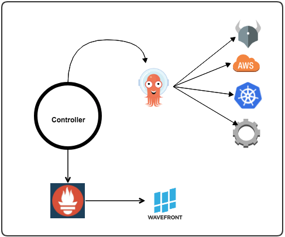

# Active-Monitor

[][GithubMaintainedUrl]
[][GithubPrsUrl]
[][SlackUrl]


[![Build Status][BuildStatusImg]][BuildMasterUrl]
[![codecov][CodecovImg]][CodecovUrl]
[![Go Report Card][GoReportImg]][GoReportUrl]

## Motivation
Active-Monitor is a Kubernetes custom resource controller which enables deep cluster monitoring and self-healing using [Argo workflows](https://github.com/argoproj/argo).

While it is not too difficult to know that all entities in a cluster are running individually, it is often quite challenging to know that they can all coordinate with each other as required for successful cluster operation (network connectivity, volume access, etc).

## Overview
Active-Monitor will create a new `health` namespace when installed in the cluster. Users can then create and submit HealthCheck object to the Kubernetes server. A HealthCheck / Remedy is essentially an instrumented wrapper around an Argo workflow.

The HealthCheck workflow is run periodically, as defined by `repeatAfterSec` or a  `schedule: cron` property in its spec, and watched by the Active-Monitor controller.

Active-Monitor sets the status of the HealthCheck CR to indicate whether the monitoring check succeeded or failed. If in case the monitoring check failed then the Remedy workflow will execute to fix the issue. Status of Remedy will be updated in the CR. External systems can query these CRs and take appropriate action if they failed.

RemedyRunsLimit parameter allows to configure how many times a remedy should be run. If Remedy action fails for any reason it will stop on further retries. It is an optional parameter. If it is not set Remedyworkflow is triggered whenever HealthCheck workflow fails.

RemedyResetInterval parameter allows resetting remedy after the reset interval time and RemedyWorkflow can be retried again in case monitor workflow fails. If remedy reaches a RemedyRunsLimit it will be reset when HealthCheck passes in any subsequent run before RemedyResetInterval. 

Typical examples of such workflows include tests for basic Kubernetes object creation/deletion, tests for cluster-wide services such as policy engines checks, authentication and authorization checks, etc.

The sort of HealthChecks one could run with Active-Monitor are:
- verify namespace and deployment creation
- verify AWS resources are using < 80% of their instance limits 
- verify kube-dns by running DNS lookups on the network
- verify kube-dns by running DNS lookups on localhost
- verify KIAM agent by running aws sts get-caller-identity on all available nodes
- verify if pod max threads has reached
- verify if storage volume for a pod (e.g: prometheus) has reached its capacity.
- verify if critical pods e.g: calico, kube-dns/core-dns pods are in a failed or crashloopbackoff state

With the Cluster/Namespace level, healthchecks can be run in any namespace provided namespace is already created.
The `level` in the `HealthCheck` spec defines at which level it runs; it can be either `Namespace` or `Cluster`.

When `level` is set to `Namespace`, Active-Monitor will create a `ServiceAccount` in the namespace as defined in the workflow spec, it will also create the `Role` and `RoleBinding` with namespace level permissions so that the `HealthChecks` in a namespace can be performed.

When the `level` is set to be `Cluster` the Active-Monitor will create a `ServiceAccount` in the namespace as defined in the workflow spec, it will also create the `ClusterRole` and `ClusterRoleBinding` with cluster level permissions so that the `HealthChecks` in a cluster scope can be performed.

## Dependencies
* [Go Language tools](golang.org)
* Kubernetes command line tool (kubectl)
* Access to Kubernetes Cluster as specified in `~/.kube/config`
  * Easiest option is to install [minikube](https://minikube.sigs.k8s.io/docs/start/) and ensure that `kubectl version` returns client and server info
* [Argo Workflows Controller](https://github.com/argoproj/argo)

## Installation Guide
```
# step 0: ensure that all dependencies listed above are installed or present

# step 1: install argo workflow controller
kubectl apply -f https://raw.githubusercontent.com/keikoproj/active-monitor/master/deploy/deploy-argo.yaml

# step 2: install active-monitor CRD and start controller
kubectl apply -f https://raw.githubusercontent.com/keikoproj/active-monitor/master/config/crd/bases/activemonitor.keikoproj.io_healthchecks.yaml
kubectl apply -f https://raw.githubusercontent.com/keikoproj/active-monitor/master/deploy/deploy-active-monitor.yaml
```

### Alternate Install - using locally cloned code
```
# step 0: ensure that all dependencies listed above are installed or present

# step 1: install argo workflow-controller
kubectl apply -f deploy/deploy-argo.yaml

# step 2: install active-monitor controller
make install
kubectl apply -f deploy/deploy-active-monitor.yaml

# step 3: run the controller via Makefile target
make run
```

## Usage and Examples
Create a new healthcheck:

## Example 1:

Create a new healthcheck with cluster level bindings to specified serviceaccount and in `health` namespace:

`kubectl create -f https://raw.githubusercontent.com/keikoproj/active-monitor/master/examples/inlineHello.yaml`

OR with local source code:

`kubectl create -f examples/inlineHello.yaml`

Then, list all healthchecks:

`kubectl get healthcheck -n health` OR `kubectl get hc -n health`

```
NAME                 LATEST STATUS   SUCCESS CNT     FAIL CNT    AGE
inline-hello-7nmzk   Succeeded        7               0          7m53s
```

View additional details/status of a healthcheck:

`kubectl describe healthcheck inline-hello-zz5vm -n health`

```
...
Status:
  Failed Count:              0
  Finished At:               2019-08-09T22:50:57Z
  Last Successful Workflow:  inline-hello-4mwxf
  Status:                    Succeeded
  Success Count:             13
Events:                      <none>
```

## Example 2:

Create a new healthcheck with namespace level bindings to specified serviceaccount and in a specified namespace:

`kubectl create ns test`

`kubectl create -f https://raw.githubusercontent.com/keikoproj/active-monitor/master/examples/inlineHello_ns.yaml`

OR with local source code:

`kubectl create -f examples/inlineHello_ns.yaml`

Then, list all healthchecks:

`kubectl get healthcheck -n test` OR `kubectl get hc -n test`

```
NAME                 LATEST STATUS   SUCCESS CNT     FAIL CNT    AGE
inline-hello-zz5vm  Succeeded         7               0          7m53s
```

View additional details/status of a healthcheck:

`kubectl describe healthcheck inline-hello-zz5vm -n test`

```
...
Status:
  Failed Count:              0
  Finished At:               2019-08-09T22:50:57Z
  Last Successful Workflow:  inline-hello-4mwxf
  Status:                    Succeeded
  Success Count:             13
Events:                      <none>
```

`argo list -n test`

```                                                                                                            
NAME                 STATUS      AGE   DURATION   PRIORITY
inline-hello-88rh2   Succeeded   29s   7s         0
inline-hello-xpsf5   Succeeded   1m    8s         0
inline-hello-z8llk   Succeeded   2m    7s         0
```
## Generates Resources
* `activemonitor.keikoproj.io/v1alpha1/HealthCheck`
* `argoproj.io/v1alpha1/Workflow`

#### Sample HealthCheck CR:
```yaml
apiVersion: activemonitor.keikoproj.io/v1alpha1
kind: HealthCheck
metadata:
  generateName: dns-healthcheck-
  namespace: health
spec:
  repeatAfterSec: 60
  description: "Monitor pod dns connections"
  workflow:
    generateName: dns-workflow-
    resource:
      namespace: health
      serviceAccount: activemonitor-controller-sa
      source:
        inline: |
            apiVersion: argoproj.io/v1alpha1
            kind: Workflow
            spec:
              ttlSecondsAfterFinished: 60
              entrypoint: start
              templates:
              - name: start
                retryStrategy:
                  limit: 3
                container: 
                  image: tutum/dnsutils
                  command: [sh, -c]
                  args: ["nslookup www.google.com"]
```
#### Sample RemedyWorkflow CR:
```
apiVersion: activemonitor.keikoproj.io/v1alpha1
kind: HealthCheck
metadata:
  generateName: fail-healthcheck-
  namespace: health
spec:
  repeatAfterSec: 60 # duration in seconds
  level: cluster
  workflow:
    generateName: fail-workflow-
    resource:
      namespace: health # workflow will be submitted in this ns
      serviceAccount: activemonitor-healthcheck-sa # workflow will be submitted using this
      source:
        inline: |
            apiVersion: argoproj.io/v1alpha1
            kind: Workflow
            metadata:
              labels:
                workflows.argoproj.io/controller-instanceid: activemonitor-workflows
            spec:
              ttlSecondsAfterFinished: 60
              entrypoint: start
              templates:
              - name: start
                retryStrategy:
                  limit: 1
                container: 
                  image: ravihari/ctrmemory:v2
                  command: ["python"]
                  args: ["promanalysis.py", "http://prometheus.system.svc.cluster.local:9090", "health", "memory-demo", "memory-demo-ctr", "95"]
  remedyworkflow:
    generateName: remedy-test-
    resource:
      namespace: health # workflow will be submitted in this ns
      serviceAccount: activemonitor-remedy-sa # workflow will be submitted using this acct
      source:
        inline: |
          apiVersion: argoproj.io/v1alpha1
          kind: Workflow
          spec:
            ttlSecondsAfterFinished: 60
            entrypoint: kubectl
            templates:
              -
                container:
                  args: ["kubectl delete po/memory-demo"]
                  command: ["/bin/bash", "-c"]
                  image: "ravihari/kubectl:v1"
                name: kubectl
```
<!-- .element height="50%" width="50%" -->

#### Access Workflows on Argo UI
```
kubectl -n health port-forward deployment/argo-ui 8001:8001
```

Then visit: [http://127.0.0.1:8001](http://127.0.0.1:8001)

## Prometheus Metrics

Active-Monitor controller also exports metrics in Prometheus format which can be further used for notifications and alerting.

Prometheus metrics are available on `:8080/metrics`
```
kubectl -n health port-forward deployment/activemonitor-controller 8080:8080
```
Then visit: [http://localhost:8080/metrics](http://localhost:8080/metrics)

Active-Monitor, by default, exports following Promethus metrics:

- `healthcheck_success_count` - The total number of successful healthcheck resources
- `healthcheck_error_count` - The total number of erred healthcheck resources
- `healthcheck_runtime_seconds` - Time taken for the healthcheck's workflow to complete

Active-Monitor also supports custom metrics. For this to work, your workflow should export a global parameter. The parameter will be programmatically available in the completed workflow object under: `workflow.status.outputs.parameters`.

The global output parameters should look like below:
```
"{\"metrics\":
  [
    {\"name\": \"custom_total\", \"value\": 123, \"metrictype\": \"gauge\", \"help\": \"custom total\"},
    {\"name\": \"custom_metric\", \"value\": 12.3, \"metrictype\": \"gauge\", \"help\": \"custom metric\"}
  ]
}"
```
<!--Re-add following line once there is a good custom-metrics example -->
<!--Here is an example: [custom-metrics.yaml](./examples/custom-metrics.yaml) which shows how to produce custom metrics.-->

## ❤ Contributing ❤

Please see [CONTRIBUTING.md](.github/CONTRIBUTING.md).

To add a new example of a healthcheck and/or workflow:

* Healthcheck: place it in [`./examples`](./examples)
* Workflow: place it in [`./examples/workflows`](./examples/workflows)

## Release Process

Please see [RELEASE](./RELEASE.md).

## License
The Apache 2 license is used in this project. Details can be found in the [LICENSE](./LICENSE) file.

## Other Keiko Projects
[Instance Manager][InstanceManagerUrl] -
[Kube Forensics][KubeForensicsUrl] -
[Addon Manager][AddonManagerUrl] -
[Upgrade Manager][UpgradeManagerUrl] -
[Minion Manager][MinionManagerUrl] -
[Governor][GovernorUrl]

<!-- URLs -->
[InstanceManagerUrl]: https://github.com/keikoproj/instance-manager
[KubeForensicsUrl]: https://github.com/keikoproj/kube-forensics
[AddonManagerUrl]: https://github.com/keikoproj/addon-manager
[UpgradeManagerUrl]: https://github.com/keikoproj/upgrade-manager
[MinionManagerUrl]: https://github.com/keikoproj/minion-manager
[GovernorUrl]: https://github.com/keikoproj/governor

[GithubMaintainedUrl]: https://github.com/keikoproj/active-monitor/graphs/commit-activity
[GithubPrsUrl]: https://github.com/keikoproj/active-monitor/pulls
[SlackUrl]: https://keikoproj.slack.com/app_redirect?channel=active-monitor

[BuildStatusImg]: https://travis-ci.org/keikoproj/active-monitor.svg?branch=master
[BuildMasterUrl]: https://travis-ci.org/keikoproj/active-monitor

[CodecovImg]: https://codecov.io/gh/keikoproj/active-monitor/branch/master/graph/badge.svg
[CodecovUrl]: https://codecov.io/gh/keikoproj/active-monitor

[GoReportImg]: https://goreportcard.com/badge/github.com/keikoproj/active-monitor
[GoReportUrl]: https://goreportcard.com/report/github.com/keikoproj/active-monitor
